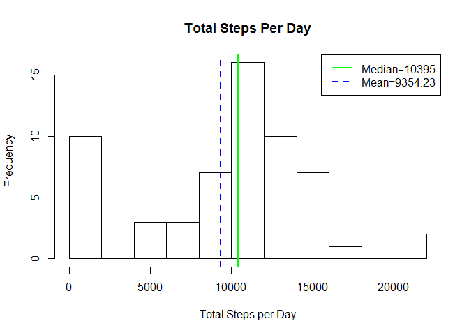
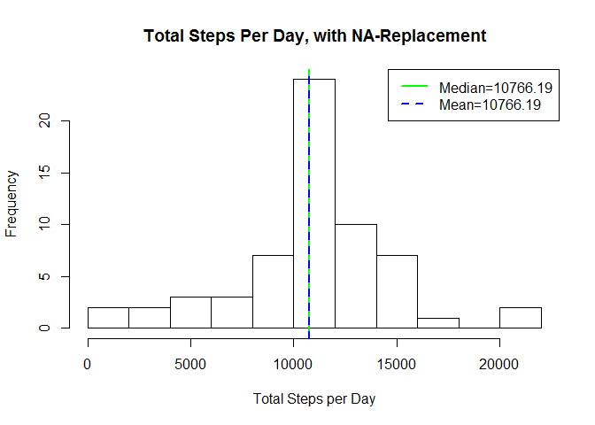

# PA1_template
Dave Nair  
April 3, 2017  


# Intro

Hello all; I'll take this moment to set some globals for the Rmd file:


```r
knitr::opts_chunk$set(echo=TRUE,results='asis',cache=TRUE)
```

Please let me know if you have any suggestions or comments!

# Stating the Problems/Questions

There are a number of questions asked in this assignment.
In order, they are:

> 1. What is the mean total number of steps taken per day ("totstep")?

> > + Calculate totstep, where totstep = "total number of steps per day"
> > + Make a histogram of totstep
> > + Calculate (and report) mean *and* median of totstep.

> 2. What is the average daily activity pattern?

> > + Make a time-series plot (`type='l'`) of the 5-min interval (x-axis) 
and the average number of steps taken, averaged across all days (y-axis).
> > + Which 5-min interval, on average across all the days in the dataset
contains the maximum number of steps?

> 3. Imputing missing values

> > + Calculate and report the total number of missing values in the
dataset (i.e., the total number of rows with NA's)
> > + Devise a strategy for filling in all of the missing values in the 
dataset. The strategy does not need to be sophisticated. For example, you 
could use the mean/median for that day, or the mean for that 5-min interval, etc..
> > + Create a new dataset that is equal to the original dataset but with the missing data filled in.
> > + Make a histogram of the totstep (from Q1) of *this* dataset. 
Calculate the **mean** and **median**; do these values differ from the 
estimates from Q1? What is the impact of imputing missing data on the 
estimates of totstep?

> 4. Are there differences in activity patterns between weekdays and weekends? 
Use the filled-in dataset; might need to use the `weekdays()` function.

> > + Create a new factor variable in the dataset with two levels - 
"weekday" and "weekend" indicating the status for a given date.

> > + Make a panel plot containing a time-series plot (`type='l'`) of the 
5-min interval (x-axis) and the average number of steps taken, averaged 
across all weekday/weekend days (y-axis). See the README file in the 
GitHub repo to see an example of what this plot should look like using 
simulated data.

## Raw Data

As per usual, let's assume this file is a huge file.
Using the command line, we can take a look at this data 
without explicitly opening it up or loading it into memory.

Note: I am having some problems running `bash` commands in Rmd; in 
the meantime, here is what those commands and responses looked 
like:

    $ head 4 activity.csv
    "steps","date","interval"
    117,"2012-10-02",2210
    9,"2012-10-02",2215
    4,"2012-10-03",410
    $ cat activity.csv | wc -l
    17569
    $ cat activity.csv | grep 'NA' | wc -l
    2304
    $ cat activity.csv | grep 'NA,' | wc -l
    2304
    $ cat activity.csv | grep -v '^[(NA)|(0,)]' | head -3
    "steps","date","interval"
    117,"2012-10-02",2210
    9,"2012-10-02",2215

So we now know that this file is 17569 lines long, with 2304 NA's - 
all of which are only found in the first column ("steps"). We also 
have a sense of what each observation looks like, 
both when it *has* complete data and when it does not.

There's not much else to really look at here, especially since 2 of the 3 columns 
are numeric. So let's just move on and tackle each problem.

### Loading in the Raw Data

As per the assignment's instructions (and now that we've *seen* the data 
and confirmed), we can load the data via `read.csv()`. For now, we will
*not* do anything with the NA's. I'd much rather leave them where they are 
and deal with them when the situation comes up.


```r
RawActivity <- read.csv('activity.csv', stringsAsFactors=FALSE)
```

Like I said, there is not much else to do in terms of transforming or manipulating 
this dataframe as is, so let's move right along to the questions.

# Functions for Plotting

Since we'll be making only histograms and time-series plots (and using 
similar-looking data), I'm just going to define specific plotting 
functions right here, which I'll call later, when I need to:


```r
PlotHistMeanMedian <- function(NumericVector, PlotTitle){
    hist(NumericVector, main=PlotTitle, xlab='Total Steps per Day', 
         breaks=10) # Note: the number of breaks was found after some visual checking
    Med = median(NumericVector, na.rm=TRUE); Mean = mean(NumericVector,na.rm=TRUE)
    abline(v=median(NumericVector, na.rm=TRUE), col='green', lwd=2)
    abline(v=mean(NumericVector, na.rm=TRUE), col='blue', lty=2, lwd=2)
    legend("topright", col=c('green','blue'), 
           legend=c(paste(c('Median=',as.character(round(Med,digits=2))),collapse=''),
                    paste(c('Mean=',as.character(round(Mean,digits=2))),collapse='')),
           lwd=2, lty=c(1,2))}

PlotTimeSeries <- function(DataFrame, Facet=FALSE){
    g <- ggplot(DataFrame, aes(Interval,StepsPerInterval)) + 
        geom_line() +
        labs(title = 'Average Daily Step Pattern',
             x = expression('Final Time of 5-min Interval, t'['f']),
             y = 'Average Number of Steps per Interval')
    
    ## Next, I want to add a vertical line @x where y(x) is highest
    ## I.e., add vline @Interval where Steps(Interval) is highest
    ## BUT!! This gets complicated when Faceting, so this will be included 
    ## in the if(Facet==TRUE) loop
    if (Facet==TRUE){
        ## Max1 is Weekday interval w max, Max2 is weekend
        tempDFSubset = subset(DataFrame,Weekend=='Weekday')
        Max1 = as.numeric(tempDFSubset$Interval[tempDFSubset$Steps==max(tempDFSubset$Steps)])
        tempDFSubset = subset(DataFrame,Weekend=='Weekend')
        Max2 = as.numeric(tempDFSubset$Interval[tempDFSubset$Steps==max(tempDFSubset$Steps)])
        
        VLineData <- data.frame(Weekend=levels(DataFrame$Weekend), 
                                vl=c(Max1,Max2),
                                vcol=c('blue','red'))
        remove(Max1,Max2)
        
        g <- g + facet_grid(Weekend ~ .)
    } else {
        Max = as.numeric(DataFrame$Interval[DataFrame$Steps==max(DataFrame$Steps)])
        VLineData <- data.frame(vl=Max,vcol='red')
        remove(Max)
    }
    
    g <- g + geom_vline(aes(xintercept=vl, col=vcol), 
                        data=VLineData, 
                        show.legend=FALSE)
    
    print(g)
}
```


# Question 1

Restated, with each step numbered:

	What is the mean total number of steps taken per day ("totstep")?
	1. Calculate totstep, where totstep = 'total number of steps per day'
	2. Make a histogram of totstep
	3. Calculate (and report) mean *and* median of totstep.
	
To calculate the "total number of steps per day", we will be using `tapply()`, 
which should make things super simple (by passing it the numeric vector of steps, the 
factor vector of dates, and the `sum()` function). Making a histogram (as well as 
reporting the mean and median) should also be trivial. 

Having our plotting functions previously defined, here is the procedure for Q1:


```r
TotalStepsPerDay <- tapply(RawActivity$steps, 
    as.factor(RawActivity$date), 
    sum, na.rm=TRUE)

## And then plot
PlotHistMeanMedian(TotalStepsPerDay, 
                   PlotTitle='Total Steps Per Day')
```

<!-- -->


# Question 2

Restated, with each step numbered:

	What is the average daily activity pattern?
	1. Make a time-series plot (`type='l'`) of the 5-min interval (x-axis) and the average number of steps taken, averaged across all days (y-axis).
	2. Which 5-min interval, on average across all the days in the dataset, contains the maximum number of steps?
	
Allowing my x-axis to be the literal, numeric value of the 5-min interval, 
we can set up our variables and plot pretty easily. This means that x-values of 
datapoints represent the **end time** of that 5-min interval's measurement. 

My function itself plots a horizontal line at the value of x for which y is highest (x *at* max(y)).
However, I have been having problems getting that value (and label) to specifically show up 
in the *legend* (and I didn't want to crowd the plot by writing it as text *on* the plot). So whereas 
the "most active" interval is shown, the actual value of that interval is returned separately in the 
code chunk below:


```r
AvgStepsPerInterval <- tapply(RawActivity$steps, 
    as.factor(RawActivity$interval),
	mean, na.rm=TRUE)

## I'm going to set up this question 1 DF to use for the rest of the problem
Q1DF <- data.frame(StepsPerInterval=AvgStepsPerInterval, 
                   Interval = sapply(names(AvgStepsPerInterval),as.numeric))

## At which time interval do we see the most step activity?
print(Q1DF$Interval[Q1DF$Steps==max(Q1DF$Steps)])
```

[1] 835

```r
PlotTimeSeries(Q1DF, Facet = FALSE)
```

<!-- -->


	
# Question 3

Restated, with each step numbered:	
	
	Imputing missing values
	1. Calculate and report the total number of missing values in the dataset (i.e., the total number of rows with NA's)
	2. Devise a strategy for filling in all of the missing values in the dataset. The strategy does not need to be sophisticated. For example, you could use the mean/median for that day, or the mean for that 5-min interval, etc..
	3. Create a new dataset that is equal to the original dataset but with the missing data filled in.
	4. Make a histogram of the 'totstep' of *this* dataset. Calculate the **mean** and **median**; do these values differ from the estimates from Q1? What is the impact of imputing missing data on the estimates of totstep?

The first step of this was done in my analysis of the raw data, but 
here is a different way of showing that there are 2304 lines 
with missing data:


```r
for (name in names(RawActivity)){
    print(paste(name, as.character(sum(is.na(RawActivity[name])))))
    }
```

[1] "steps 2304"
[1] "date 0"
[1] "interval 0"

For the purposes of this assignment, we will replace NA's with the mean 
for that given 5-min interval, as suggested. Let's create our new, filled 
dataset. To create this, we will be making (subsetting) a brand new one, and then 
appending to it as we iterate through each possible interval.


```r
## First, we'll subset for activity WITHOUT NA vals
FilledActivity <- RawActivity[!is.na(RawActivity$steps), ]
## Next, we'll iterate through each possible interval, 
## and replace NA vals with *that* interval's associated average
for (Interval in as.numeric(names(AvgStepsPerInterval))){
	Condition = is.na(RawActivity$steps) & RawActivity$interval==Interval
    temp = RawActivity[Condition, ]
	## we've subset temp, now we need to replace the NA vals
	temp[is.na(temp)] <- AvgStepsPerInterval[[ as.character(Interval) ]]
	## and then append it to our growing dataframe
	FilledActivity <- rbind(FilledActivity, temp)
}
```

Let's make sure we *did* fill up the same-sized dataframe; i.e., 
let's see if it has the same dimensions and if it has *any* NA values:


```r
dim(RawActivity)==dim(FilledActivity); sum(is.na(FilledActivity$steps))
```

[1] TRUE TRUE
[1] 0

Now that all the NA vals have been taken care of, let's plot like how we did in question 1:


```r
NEWTotalStepsPerDay <- tapply(FilledActivity$steps, 
    as.factor(FilledActivity$date), 
    sum, na.rm=TRUE)
PlotHistMeanMedian(NEWTotalStepsPerDay,
                   PlotTitle='Total Steps Per Day, with NA-Replacement')
```

<!-- -->
	
# Question 4

Restated, with each step numbered:	
	
	Are there differences in activity patterns between weekdays and weekends? Use the filled-in dataset; might need to use the `weekdays()` and `as.Date()` functions.
	1. Create a new factor variable in the dataset with two levels - "weekday" and "weekend" indicating the status for a given date.
	2. Make a panel plot containing a time-series plot (`type='l'`) of the 5-min interval (x-axis) and the average number of steps taken, averaged across all weekday/weekend days (y-axis). See the README file in the GitHub repo to see an example of what this plot should look like using simulated data.
	
So let's add a weekday/weekend factor variable to our `FilledActivity` dataframe. 
This should be straightforward and simple.


```r
WeekendNames = c('Saturday', 'Sunday')
FilledActivity$Weekend <- factor( 
    weekdays(as.Date(FilledActivity$date)) %in% WeekendNames, 
	levels=c(FALSE, TRUE), labels=c('Weekday', 'Weekend')
	)
```

Okay, so now `FilledActivity$Weekend` contains whether each entry is 
a weekday or weekend. We want the AverageStepPerInterval (something we've 
calculated before) *per weekend factor*. 

Whereas factoring by the weekend factor is trivial, I wasn't entirely sure 
how to factor the average by both its weekend factor *and* its interval. Rather 
than trying to get `ggplot2` to do all that, I'm just going to quickly 
create two sets and `rbind()` them into a pretty dataframe for my 
previously defined `PlotTimeSeries()` function.


```r
temp <- subset(FilledActivity, Weekend=='Weekday')
wdAverages <- tapply( temp$steps,
                      as.factor(temp$interval),
                      mean, na.rm=TRUE)
temp <- subset(FilledActivity, Weekend=='Weekend')
weAverages <- tapply( temp$steps,
                      as.factor(temp$interval),
                      mean, na.rm=TRUE)
remove(temp)
WeekendDF <- data.frame( 
        StepsPerInterval = c(wdAverages, weAverages), 
	    Interval = c(sapply(names(wdAverages),as.numeric), 
	                 sapply(names(weAverages),as.numeric)), 
        Weekend = c(rep('Weekday',length(wdAverages)), rep('Weekend',length(weAverages))))
```

And finally, let's send our `WeekendDF` into our `PlotTimeSeries(Facet=TRUE)` function. 
`Facet=TRUE` is set in order to facet this by the weekend factor (obviously). 
This factoring is *defined* in the function itself. 
I.e., it cannot be facetted by any other category at this point:


```r
PlotTimeSeries( WeekendDF , 
	Facet = TRUE)
```

<!-- -->
